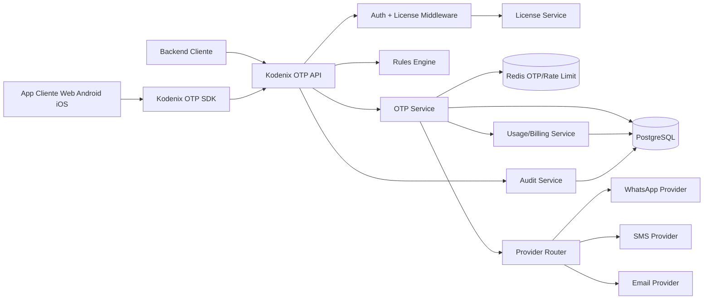
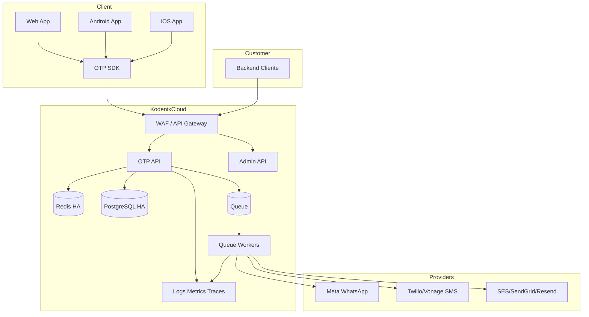
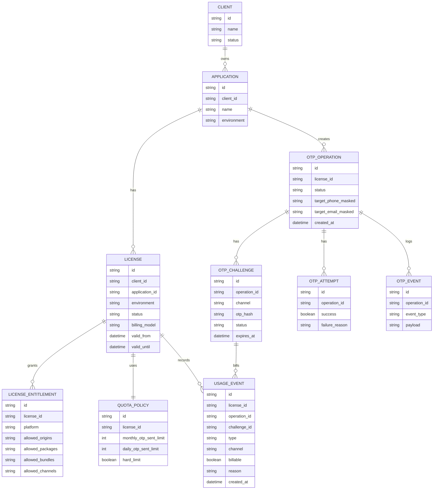
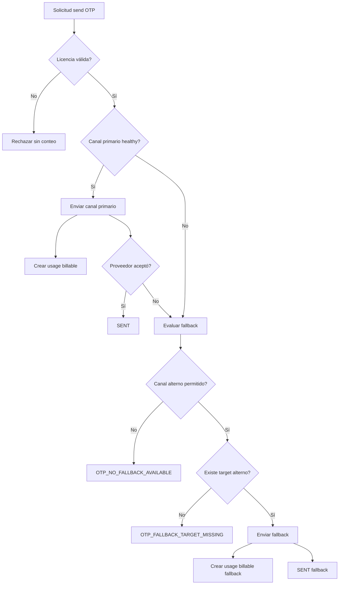
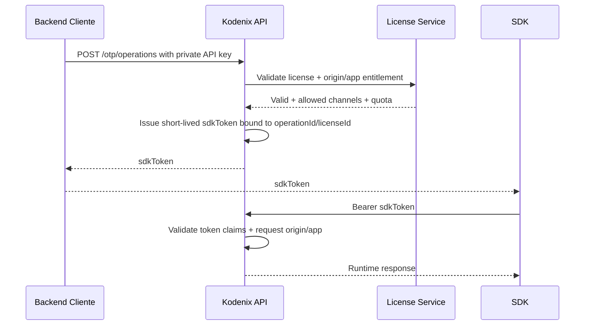
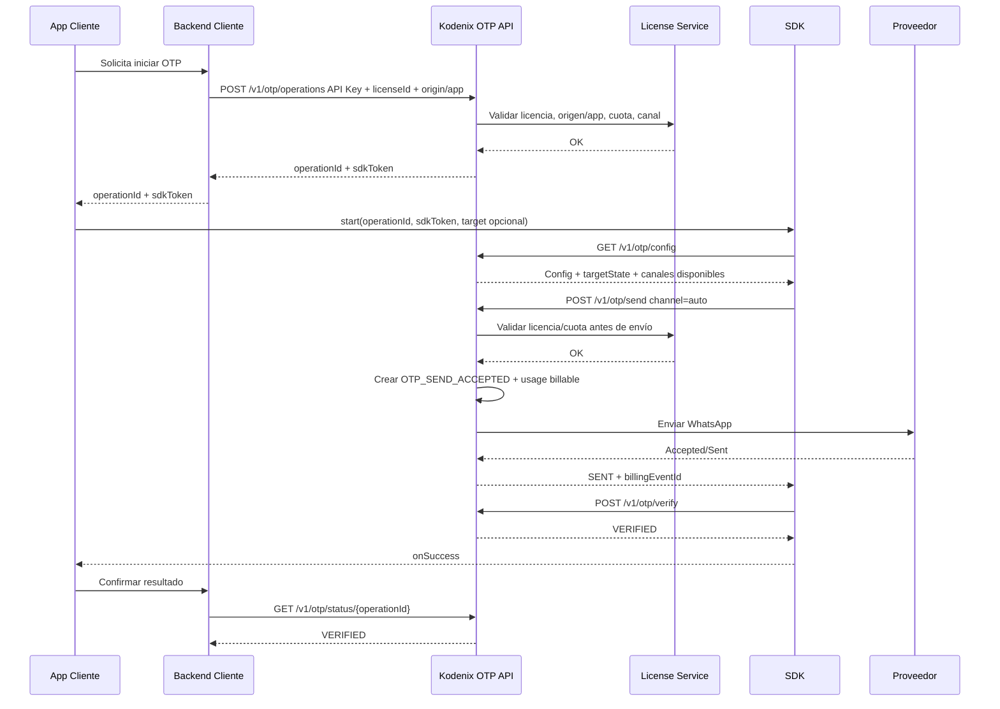
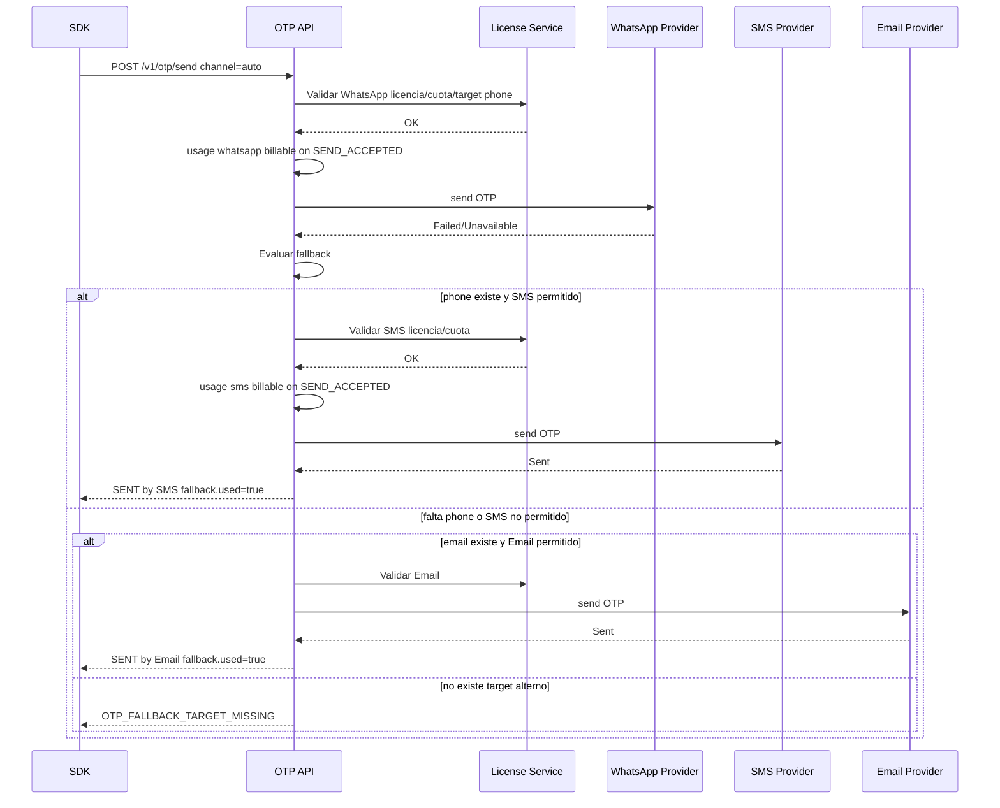
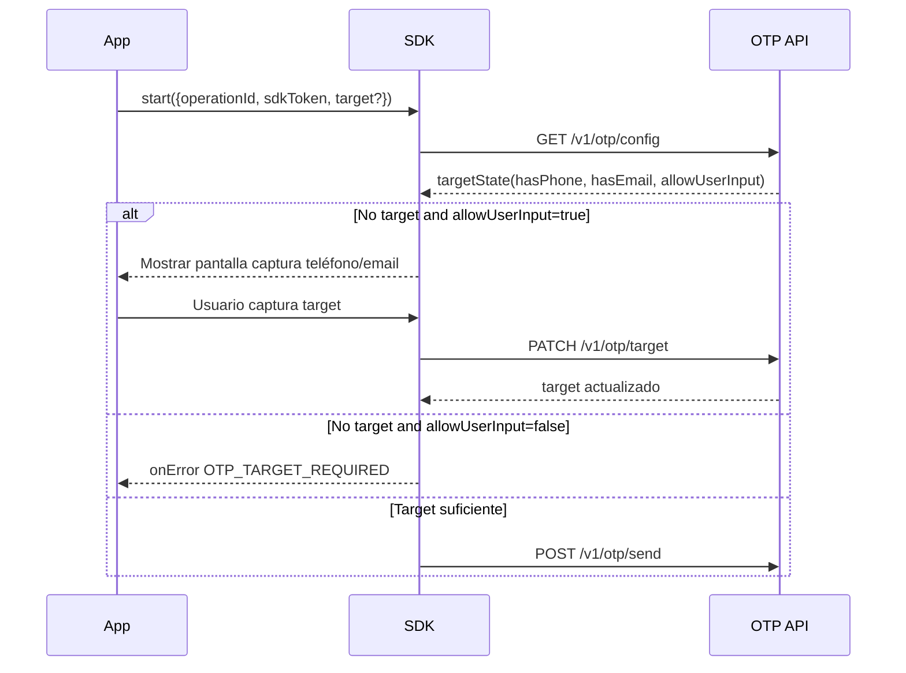
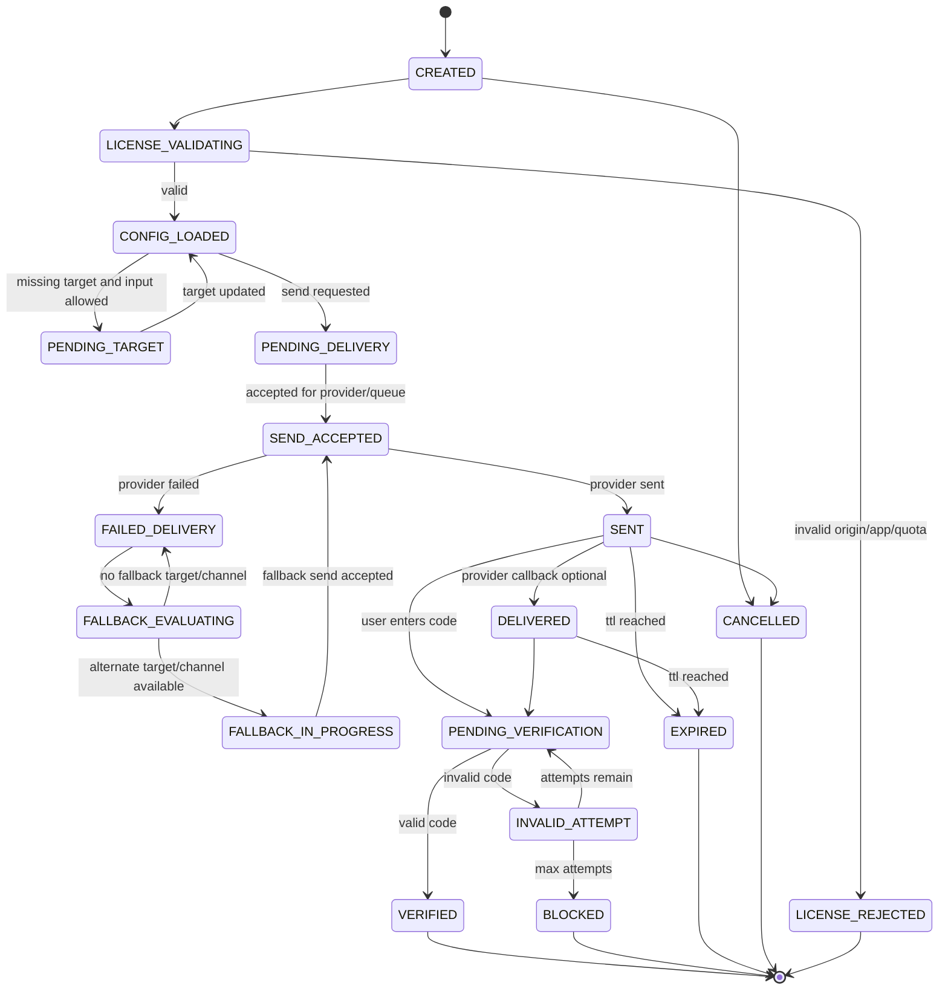

# Diagramas Mermaid

Vista consolidada de diagramas técnicos de Kodenix Verify OTP.

Los archivos `.mmd` se conservan como fuente editable y este documento mantiene los diagramas embebidos para navegación visual dentro del repositorio.

## Component

Fuente: [`component.mmd`](component.mmd)

## Deployment

Fuente: [`deployment.mmd`](deployment.mmd)

## Erd Licensing

Fuente: [`erd-licensing.mmd`](erd-licensing.mmd)

## Outage Flow

Fuente: [`outage-flow.mmd`](outage-flow.mmd)

## Security Token Flow

Fuente: [`security-token-flow.mmd`](security-token-flow.mmd)

## Sequence Enterprise License

Fuente: [`sequence-enterprise-license.mmd`](sequence-enterprise-license.mmd)

## Sequence Provider Fallback

Fuente: [`sequence-provider-fallback.mmd`](sequence-provider-fallback.mmd)

## Sequence Sdk Init Target Optional

Fuente: [`sequence-sdk-init-target-optional.mmd`](sequence-sdk-init-target-optional.mmd)

## State Machine

Fuente: [`state-machine.mmd`](state-machine.mmd)

